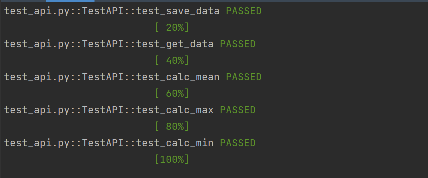

## 🔖 Sobre
O objetivo deste trabalho foi aprimorar técnicas de clean code, log e testes. O desenvolvimento ocorreu a partir do estudo do curso Acelera Dev da empresa [Codenation](https://www.codenation.dev/). 
A ementa desse curso abordou:

- PEP 8 (https://www.python.org/dev/peps/pep-0008/)
- Padrão de projeto
- Testes
- Construção de uma API

</br>

<p align="center"> 
  
</p>

</br>

## 🚀 Bibliotecas utilizadas

- [Pytest](https://docs.pytest.org/en/6.2.x/)
- [Loguru](https://loguru.readthedocs.io/en/stable/api/logger.html)
- [Flask](https://flask.palletsprojects.com/en/2.0.x/)


</br>

## 🗂 Como baixar e iniciar o projeto

```bash
# Abra um terminal e copie este repositório com o comando
$ git clone https://github.com/cbvreis/api-tests-clean-code.git
# ou use a opção de download.

pip install -r requirements.txt

# Entrar no diretorio **/api-tests-clean-code**
$ cd api-tests-clean-code
python run main.py
```


<br>

Desenvolvido por [Cássio Reis](https://www.linkedin.com/in/cassioreisdevelop/) 🤓

